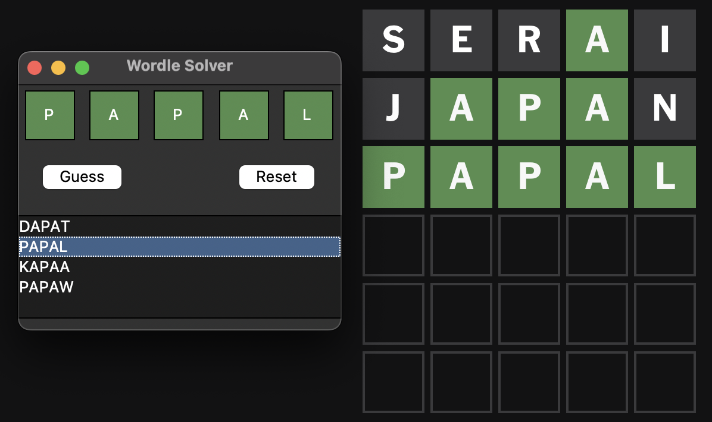
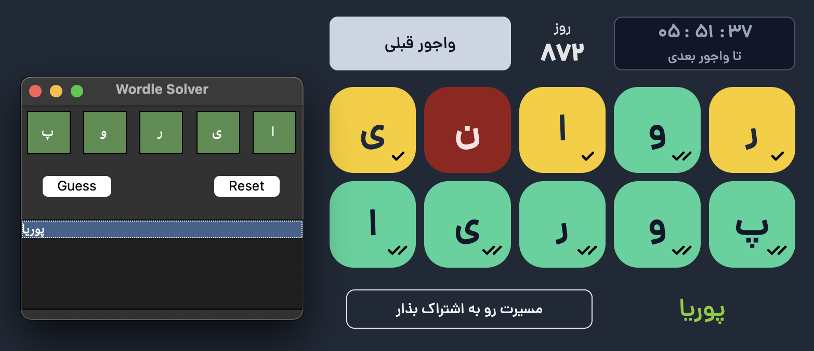

# Wordle Game Solver

<p align="center">
  
  
</p>


This is a script to help you solve Wordles! It includes datasets for English and Persian languages.

Also provides a nice interacive GUI.

A Persian blog post is written for this project which you can read it [here](https://shahriarshm.com/?p=104).

## Installation

### Prerequisites
Ensure you have the following installed on your system:
- Python 3.9 or higher
- `pip` (Python package installer)

### Setup
1. Clone the repository:
    ```bash
    git clone https://github.com/shahriarshm/wordle-solver
    cd wordle-solver
    ```

2. Create a virtual environment (recommended):
    ```bash
    python -m venv venv
    ```

3. Activate the virtual environment:
    - On Windows:
        ```bash
        .\venv\Scripts\activate
        ```
    - On macOS and Linux:
        ```bash
        source venv/bin/activate
        ```

4. Install the Pandas library:
    ```bash
    pip install pandas
    ```

## Usage

### Prepare Dataset
You can prepare your own 5-letter word dataset with score and count (word frequency) using `prepare_scored_words.py` and `prepare_unigram_freq.py` modules.

### Run App
Run the app with given dataset. For example:
```bash
python wordle_solver "datasets/5_letter_scored_english_words.csv"
```

